# Rappel : Tableau à deux dimension 
Tableaux bidimensionnels 
Un tableau bidimensionnel est une liste de tableaux unidimensionnels. Pour déclarer un  tableau d’entier à deux dimensions de taille [x] [y], vous devez écrire quelque chose comme  suit 

 ** type nomtab[x][y]; **

 type peut être n’importe quel type de données valide et nomtab sera un identifiant valide. Un  tableau bidimensionnel peut être considéré comme une table qui aura x nombre de lignes et  y nombre de colonnes.

 Ainsi, chaque élément du tableau tab est identifié par un nom de la forme tab [i] [j], où  «tab» est le nom du tableau et «i» et «j» sont les indices qui identifient de façon unique  Chaque élément dans ‘tab’. 

#### Initialisation d’un tableau bidimensionnelle 

Les tableaux multidimensionnelles peuvent être initialisées en spécifiant des valeurs entre  parenthèses pour chaque ligne. Voici un tableau avec 3 lignes et chaque ligne a 4 colonnes. 
```
int tab[3][4]  = {
  {0,1,2,3} ,
  {4,5,6,7} ,
  {8,9,10,11} 
};
```

Les accolades imbriquées sont facultatives. L’initialisation suivante est équivalente à  l’exemple précédent
```
int tab[3][4] = 
{0,1,2,3,4,5,6,7,8,9,10,11};
```

#### Accès aux éléments d’un tableau à deux dimensions 

Un élément d’un tableau bidimensionnel est accessible en utilisant les indices, c’est-à-dire  l’indice de ligne et l’indice de colonne du tableau. Par exemple


L’instruction ci-dessus prendra le 3ème élément de la 2ème ligne du tableau. Nous allons  vérifier le programme suivant où nous avons utilisé une boucle imbriquée pour manipuler un  tableau bidimensionnel 

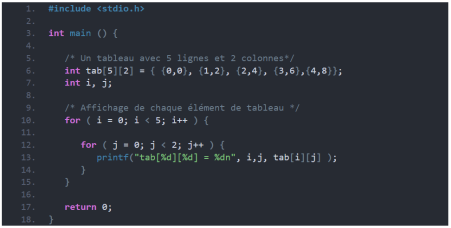

Lorsque le code ci-dessus est compilé et exécuté, il produit le résultat suivant

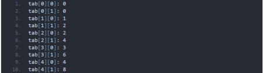

#### Tableaux en paramètre de fonction  

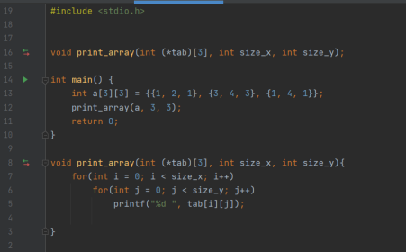

# Rappel : la programmation modulaire  

## Les fichier d’en-tête (header) 
Jusqu’à présent, lorsque vous voulez utiliser une fonction ou une variable définie dans un  autre fichier, vous insérez sa déclaration dans le fichier ciblé. Seulement voilà, si vous  utilisez dix fichiers et que vous décidez un jour d’ajouter ou de supprimer une fonction ou  une variable ou encore de modifier une déclaration, vous vous retrouvez Gros-Jean comme  devant et vous êtes bon pour modifier les dix fichiers, ce qui n’est pas très pratique… 
Pour résoudre ce problème, on utilise des fichiers d’en-têtes (d’extension « .h »). Ces  derniers contiennent conventionnellement des déclarations de fonctions et de variables et  sont inclus via la directive #include dans les fichiers qui utilisent les fonctions et variables en  question. 
La structure d’un fichier d’en-tête est généralement de la forme suivante.

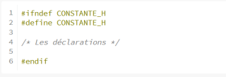

Les directives du préprocesseur sont là pour éviter les inclusions multiples : vous devez les  utiliser pour chacun de vos fichiers d’en-têtes. Vous pouvez remplacer CONSTANTE par ce  que vous voulez, le plus simple et le plus fréquent étant le nom de votre fichier, par exemple  

AUTRE_H si votre fichier se nomme « autre.h ». Voici un exemple d’utilisation de fichiers d’en têtes. 

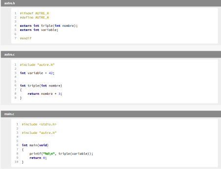
```
Plusieurs remarques à propos de ce code : 

• Dans la directive d’inclusion, les fichiers d’en-têtes sont entre guillemets et non entre  chevrons comme les fichiers d’en-têtes de la bibliothèque standard ; 
• Les fichiers sources et d’en-têtes correspondants portent le même nom ; 
• Je vous conseillons d’inclure le fichier d’en-tête dans le fichier source correspondant  (dans mon cas « autre.h » dans « autre.c ») afin d’éviter des problèmes de portée.
```

** Essayons maintenant de mettre tout ça en pratique avec un petit TP regroupant toutes ces notions **

# Architecture du projet
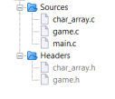

## TP : le Morpion

Le tic-tac-toe, aussi appelé « morpion » (par analogie au jeu de morpion) et « oxo » en  Belgique, est un jeu de réflexion se pratiquant à deux joueurs au tour par tour dont le but est  de créer le premier un alignement. Le jeu se joue généralement avec papier et crayon. 
Deux joueurs s'affrontent. Ils doivent remplir chacun à leur tour une case de la grille avec le  symbole qui leur est attribué : O ou X. Le gagnant est celui qui arrive à aligner trois symboles  identiques, horizontalement, verticalement ou en diagonale. Il est coutume de laisser le  joueur jouant X effectuer le premier coup de la partie. 

Une partie gagnée par le joueur X : 


Ou une partie nul

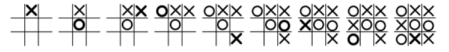

### Palier 1 : notre grille 

Nous commencerons par rédiger les fonctions utile à notre grille de jeu dans le fichier  char_array.c, ajouter ce fichier à votre projet ainsi que le fichier header correspondant :  char_array.h 

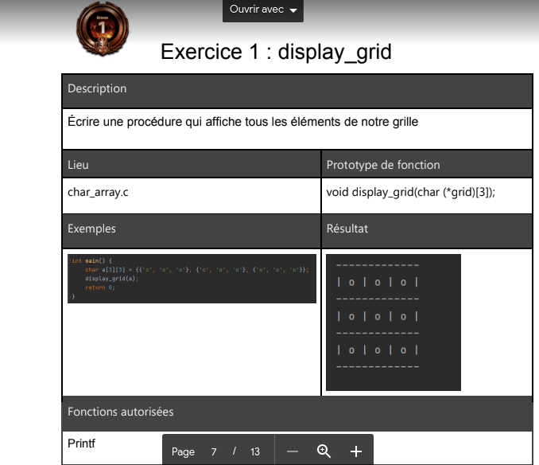


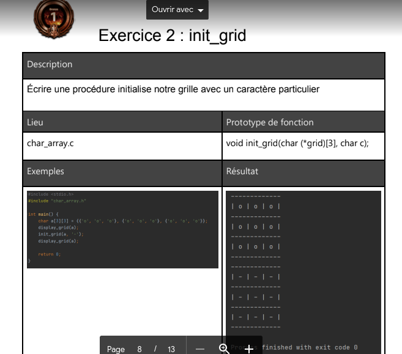


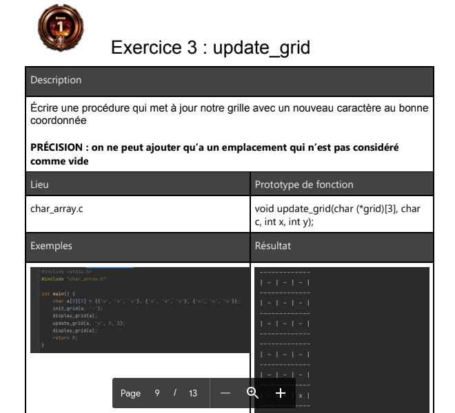


### Palier 2 : notre système de jeu

Il est temps de rédiger notre système de jeu, les fonctions de celui-ci seront situées dans un
nouveau fichier : game.c, ajouter le header correspondant

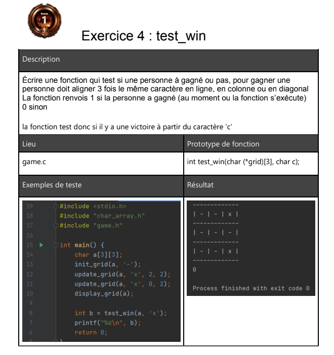
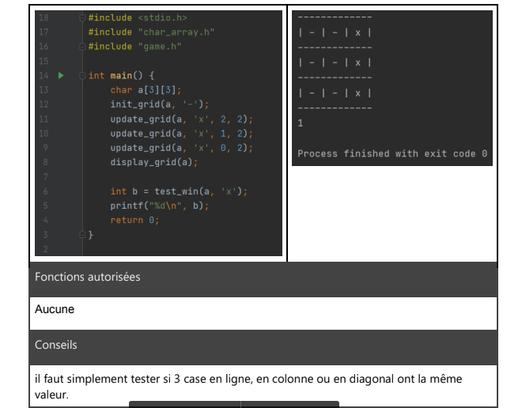

### Palier 3 : Notre boucle de jeu

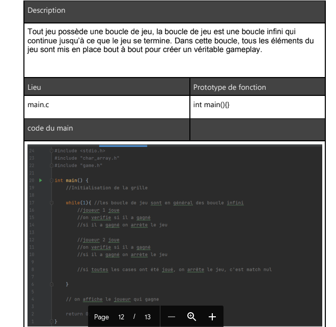
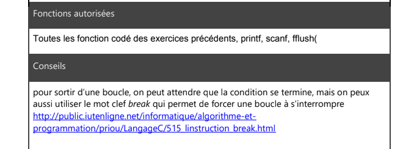


### Palier 4 : Bonus

interface graphique (https://openclassrooms.com/fr/courses/19980-apprenez-a-programmer-
en-c/17117-installation-de-la-sdl), compteur de point, classement, ia parfaite, options de

lancement, etc etc etc etc.


  
  
  